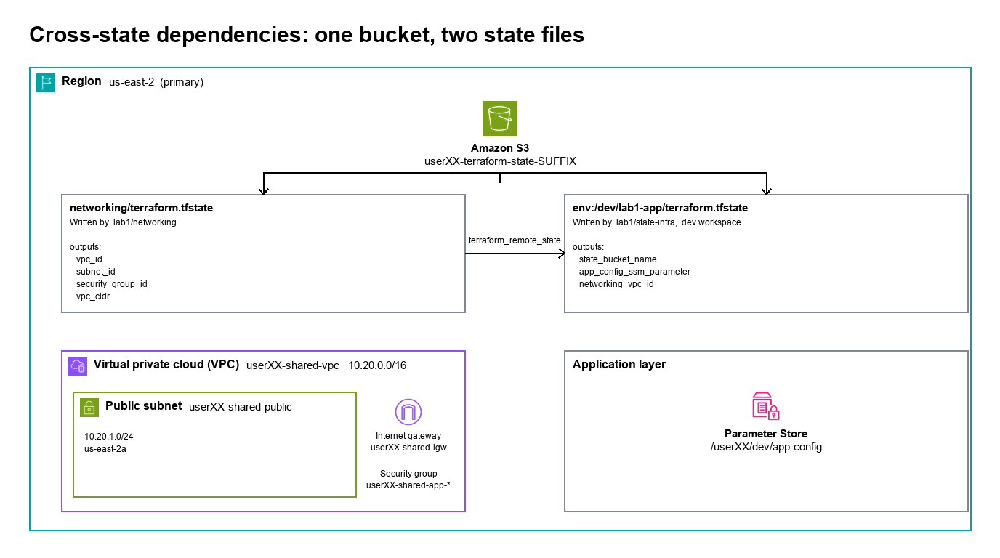

# Lab 1: Multi-Environment State Strategy

*Terraform Day 3: Enterprise Deployment & Operations*

| | |
|---|---|
| **Course** | Terraform on AWS (300-Level) |
| **Chapter** | Enterprise Workspaces & Cross-Environment Dependencies |
| **Duration** | 90 minutes |
| **Difficulty** | Advanced |
| **Version** | 5.0 |
| **Prerequisites** | Workspace concepts from Day 2 Chapter 7 (lecture). No prior lab work is needed — you build your own VM in Task 1 and this lab creates its own S3 state bucket. |
| **Terraform** | >= 1.10.0 |
| **Lab Files** | [github.com/AWSClassroom-com/Advanced_Terraform](https://github.com/AWSClassroom-com/Advanced_Terraform) → `lab1/state-infra/`, `lab1/networking/` (`lab1/directories/` is reference material for the directory-per-environment pattern covered in the lecture) |
| **Answers** | [`answers/lab1/`](../answers/lab1/) — complete code, including the Challenges. Try the lab first. |
---

## Lab Overview

### Narrative

Your organization already runs Terraform: remote state in S3 with encryption, versioning, and native locking, and configurations refactored with `moved` blocks.

Now your platform team faces a strategic challenge: **how should you organize state across 40 microservices and 3 environments?**

Three teams have different approaches:

- **Payments team** — uses separate directories (`payments-dev/`, `payments-staging/`, `payments-prod/`). Safe, but lots of code duplication across three near-identical trees.
- **Checkout team** — uses workspaces for everything. Elegant single config, but had a near-miss when an engineer applied to prod thinking they were in dev.
- **Networking team** — maintains a shared VPC that every other team needs to reference. How do other teams get the VPC ID without hardcoding it everywhere?

Your task: build your workstation, learn Terraform workspaces, implement workspace safety guards, and configure cross-state dependencies using `terraform_remote_state`.

### Learning Objectives

By the end of this lab, you will be able to:

- **Build the EC2 workstation** you will use for the rest of the course

- **Use Terraform workspaces** to manage multiple environments from a single configuration
- **Implement workspace safety guards** using preconditions to prevent accidental production applies
- **Configure cross-state dependencies** using `terraform_remote_state` to read outputs from another state file
- **Read a state file directly** with `terraform state pull` and `jq`

---

## Architecture Overview



*Figure: Networking state exports outputs that the application state reads via `terraform_remote_state`. Each workspace gets its own state path with the `env:/` prefix.*

### Key Concepts

| Concept | Definition |
|---|---|
| **Workspace** | A named instance of Terraform state within a single configuration. Each workspace has its own state file. |
| **terraform.workspace** | Built-in variable that returns the name of the current workspace. Use it to customize resources per environment. |
| **terraform_remote_state** | Data source that reads outputs from another Terraform state file. Enables loose coupling between infrastructure layers. |
| **State Boundary** | The logical division between what resources belong in one state file versus another. Based on team ownership and change frequency. |

---

## Task 1: Build Your Lab Environment (30 min)

You will run every Terraform command in this course from a small EC2 instance rather than from
your own machine. Building it yourself takes a few minutes and means nothing in this course
appears by magic.

1. **Launch the deployment VM**

    1. Open the [AWS Management Console](https://console.aws.amazon.com/) and sign in with the account, username, and password your instructor gave you.
    2. Select your assigned region in the top-right region picker. Every resource you create today goes in that region unless a step says otherwise.
    3. Search for **EC2** in the top search bar and open the service.
    4. Click **Launch instance**.
    5. In **Name**, enter `deploy-userXX`, substituting your own assigned ID.
    6. Leave the image as the default **Amazon Linux 2023**.
    7. Set **Instance type** to **t3.small**.
    8. Under **Key pair (login)**, select **Proceed without a key pair**.
    9. In **Network settings**, click **Edit**, then create a new security group named `userXX-Allow SSH`. Use the same string for the description. Leave the rule allowing SSH on port 22.
    10. Under **Configure storage**, set the root volume to **20 GiB**.
    11. Expand **Advanced details** and set **IAM instance profile** to `Terraform-InstanceRole`.
    12. Click **Launch instance**.

    > **Why an instance profile instead of access keys?** The role is attached to the machine, so
    > the AWS CLI and Terraform pick up credentials automatically and there is no key to leak or
    > rotate. It also changes what CloudTrail records about you, which is the subject of Lab 4.

2. **Connect to the VM**

    1. Click **Instances**, then select the checkbox next to your instance.
    2. Click **Connect**, stay on the **EC2 Instance Connect** tab, and click **Connect**.

    A terminal opens in a new browser tab. Everything from here to the end of the course happens
    in that terminal unless a step says otherwise.

3. **Configure the AWS CLI**

    ```bash
    aws configure
    ```
    Press **ENTER** at both **AWS Access Key ID** and **AWS Secret Access Key** to leave them
    blank — the instance profile supplies credentials. Enter your assigned region, then `json`
    for the output format.

    Confirm the CLI can reach AWS:

    ```bash
    aws sts get-caller-identity
    ```
    **Expected:**
    ```
    "Arn": "arn:aws:sts::<account>:assumed-role/Terraform-InstanceRole/i-0abc123..."
    ```
    Notice the ARN names the **role** and the instance, not you. Lab 4 returns to that.

4. **Install Terraform**

    ```bash
    sudo yum install -y yum-utils
    sudo yum-config-manager --add-repo https://rpm.releases.hashicorp.com/AmazonLinux/hashicorp.repo
    sudo yum -y install terraform
    terraform -v
    ```
    **Expected:** a version line. Anything 1.10 or newer works for this course.

5. **Clone the lab repository**

    ```bash
    cd ~
    git clone https://github.com/AWSClassroom-com/Advanced_Terraform.git
    cd Advanced_Terraform/lab1/state-infra
    ```

---

## Task 2: Workspace Fundamentals (12 min)

In Day 2 Chapter 7 you saw Terraform workspaces in lecture. Here you use them.


6. **Review the Backend Configuration (do not edit yet)**

    Open `providers.tf` and read the backend block. **It's commented out on purpose** — the lab is self-contained:

    ```hcl
    terraform {
      required_version = ">= 1.10.0"

      # Remote state backend - uncomment in Step 12, once the bucket exists.
      # backend "s3" {
      #   key          = "lab1-app/terraform.tfstate"
      #   encrypt      = true
      #   use_lockfile = true   # S3 native locking (Terraform 1.10+)
      # }

      required_providers {
        aws = {
          source  = "hashicorp/aws"
          version = "~> 6.0"
        }
      }
    }
    ```

    **Why commented out?** This directory *creates* the state bucket, and you cannot point a backend at a bucket that does not exist yet. So this configuration starts on **local state**, creates the bucket, and migrates to the bucket afterwards in Step 12.

    > **About `use_lockfile = true`:** Terraform 1.10+ locks state using S3 itself, so there is no DynamoDB table anywhere in this course. It works by conditionally creating a `.tflock` object next to the state file — S3 refuses the write if one already exists, and that refusal *is* the lock. The bucket needs no special configuration for this.
    >
    > **Production note:** In production, you'd add a bucket policy with least-privilege IAM (`s3:GetObject`, `s3:PutObject`, `s3:ListBucket` on specific paths). For this lab, we rely on your existing classroom permissions.

7. **Initialize Terraform**

    ```bash
    terraform init
    ```
8. **Create the environment workspaces**

    Every configuration starts in a workspace called `default`. List what exists, then create the
    three you need:

    ```bash
    terraform workspace list
    terraform workspace new dev
    terraform workspace new staging
    terraform workspace new prod
    terraform workspace list
    ```
    **Expected:**
    ```
      default
      dev
    * prod
      staging
    ```
    The asterisk marks the workspace you are in. `workspace new` switches you to the one it just
    created, which is why you end up in `prod`.

9. **Switch workspaces and confirm the state is separate**

    ```bash
    terraform workspace select dev
    terraform workspace show
    terraform state list

    terraform workspace select staging
    terraform state list
    ```
    **Expected:** `dev` from `workspace show`, and no output from either `state list`. Nothing is
    deployed yet, and each workspace reads a different state file.

    > **Production note:** Workspaces isolate *state*, not *credentials*. The same AWS IAM permissions apply regardless of which workspace you're in. In production environments, teams often use separate AWS accounts per environment (dev/staging/prod) with IAM role assumption, so that workspace selection alone cannot accidentally modify production resources.


10. **Use terraform.workspace in Configuration**

    Open `variables.tf` and examine how workspace affects configuration:

    ```hcl
    locals {
      # Environment-specific settings based on workspace
      environment_config = {
        dev = {
          instance_type = "t3.micro"
          min_size      = 1
          max_size      = 2
        }
        staging = {
          instance_type = "t3.small"
          min_size      = 2
          max_size      = 4
        }
        prod = {
          instance_type = "t3.medium"
          min_size      = 3
          max_size      = 10
        }
      }

      # Select config for current workspace
      config = local.environment_config[terraform.workspace]
    }
    ```

    **Key insight:** `terraform.workspace` returns `"dev"`, `"staging"`, or `"prod"` depending on which workspace is active. This lets one configuration serve multiple environments.

## Task 3: Workspace Safety Guards (15 min)

The checkout team's near-miss happened because a junior engineer thought they were in `dev` but were actually in `prod`. You'll implement safety guards to prevent this.

11. **Configure your variables and create the state bucket**

    ```bash
    terraform workspace select dev
    cp terraform.tfvars.example terraform.tfvars
    ```

    Open `terraform.tfvars` and set `user_id` to your assigned AWS login ID. Use a **concrete**
    value like `user07`; `user_id` is validated against `^user[0-9]{2}$`, so the literal
    placeholder `userXX` fails at plan time:

    ```hcl
    user_id = "user07"  # ← REPLACE 07 with YOUR assigned user number
    ```

    Leave `primary_region`, `bucket_region`, and `state_bucket_name` commented out. You will set
    `state_bucket_name` in Step 18.

    ```bash
    terraform plan
    terraform apply
    ```
    Review the plan, then type `yes` at the apply prompt. The apply creates an `aws_s3_bucket`
    named `<user_id>-terraform-state-<random6>`; the random suffix guarantees the name is
    globally unique, so no two students can collide.

    > **Notice `aws_s3_bucket_metric` in the plan.** S3 reports storage metrics for free, but request metrics such as `GetRequests` and `PutRequests` are opt-in: nothing records them until a metrics configuration asks for them. Turning it on here means every `terraform plan` and `apply` you run for the rest of the day leaves a measurable trace on this bucket, which is what Lab 4's dashboard reads. It is worth seeing the order of events: you have to decide to collect the data **before** the activity happens. Auditing is not something you can switch on afterwards and backfill.

    **Capture the bucket name.** You need it in Steps 12, 16, and 18:

    ```bash
    terraform output state_bucket_name
    ```
    **Expected** (your suffix will differ):

    ```
    state_bucket_name = "user07-terraform-state-x8k2m4"
    ```

    Write this value down. Every later reference to "your state bucket" means this exact string.

12. **Migrate the state into the bucket**

    Everything so far has been on local state, because the backend block in `providers.tf` is
    commented out — the bucket did not exist yet. It does now.

    Open `providers.tf` and uncomment the backend block. Notice what it does **not** contain:

    ```hcl
    backend "s3" {
      key          = "lab1-app/terraform.tfstate"
      encrypt      = true
      use_lockfile = true
    }
    ```

    > **Where are `bucket` and `region`?** A backend block cannot read variables — Terraform has
    > to initialize the backend before it can evaluate anything. So both values are passed at
    > init time instead. You used the same `-backend-config` pattern in Day 1-2 when you migrated
    > state to your first bucket.

    ```bash
    terraform init -migrate-state \
        -backend-config="bucket=<your state bucket>" \
        -backend-config="region=<your bucket region>"
    ```
    When prompted *"Do you want to copy existing state to the new backend?"*, type `yes`.

    ```bash
    aws s3 ls "s3://$(terraform output -raw state_bucket_name)/" --recursive
    ```
    **Expected:** one key under `env:/dev/lab1-app/`. Non-default workspaces get an
    `env:/<workspace>/` prefix, and that prefix is what keeps their state files apart. The other
    workspaces get theirs the first time you apply while sitting in them.


13. **Review the Workspace Safety Guard**

    Open `workspace_guard.tf` and examine the safety mechanism.

    > **What is `null_resource`?** A `null_resource` is a placeholder resource that doesn't create any actual infrastructure. It's useful for running provisioners or, as we use it here, for attaching `lifecycle` blocks with preconditions. The preconditions are evaluated during `terraform plan`, so invalid workspaces are caught before any real resources are touched.

    ```hcl

    # Workspace Safety Guard
    # Prevents accidental operations in wrong workspace

    locals {
      # Define allowed workspaces
      allowed_workspaces = ["dev", "staging", "prod"]

      # Production requires extra confirmation
      is_production = terraform.workspace == "prod"
    }

    # Block operations in default workspace
    resource "null_resource" "workspace_guard" {
      lifecycle {
    precondition {
      condition     = terraform.workspace != "default"
      error_message = <<-EOT
        ERROR: Cannot run Terraform in 'default' workspace.

        Please select an environment workspace:
          terraform workspace select dev
          terraform workspace select staging
          terraform workspace select prod

        Or create a new workspace:
          terraform workspace new dev
      EOT
    }

    precondition {
      condition     = contains(local.allowed_workspaces, terraform.workspace) || startswith(terraform.workspace, "feature-")
      error_message = <<-EOT
        ERROR: Workspace '${terraform.workspace}' is not allowed.

        Allowed workspaces: ${join(", ", local.allowed_workspaces)}
        Or use a feature branch workspace: feature-*
      EOT
    }
      }
    }

    # Production warning output
    output "production_warning" {
      value = local.is_production ? "WARNING: You are operating in PRODUCTION!" : null
    }
    ```
    **How it works:**
    - `precondition` blocks are evaluated during `terraform plan` when Terraform processes this resource
    - If a precondition fails, Terraform stops planning immediately -- no resources are created or modified
    - First precondition blocks the `default` workspace entirely
    - Second precondition allows only `dev`, `staging`, `prod`, or `feature-*` workspaces
    - Production workspace triggers a warning output

14. **Test the workspace guard**

    Switch to `default` and plan:

    ```bash
    terraform workspace select default
    terraform plan
    ```
    **Expected error:**
    ```
    Error: Resource precondition failed

      on workspace_guard.tf line X, in resource "null_resource" "workspace_guard":

    ERROR: Workspace 'default' is not allowed.

    Allowed workspaces: dev, staging, prod
    Or use a feature branch workspace: feature-*
    ```
    Both preconditions fail for `default`; Terraform surfaces the second one because its message
    is the more general of the two. Now switch back and plan again:

    ```bash
    terraform workspace select dev
    terraform plan
    ```
    The plan succeeds, because `dev` is in the allowed list. Nothing was created or modified while
    the guard was failing.


15. **Test Feature Branch Pattern**

    ```bash
    terraform workspace new feature-login-fix
    terraform plan
    ```
    The plan succeeds because `feature-*` workspaces are allowed for ephemeral feature branch environments.

    > **When to use feature workspaces:** In CI/CD pipelines, teams often create temporary workspaces like `feature-login-fix` or `pr-123` to test infrastructure changes in isolation before merging to main. After the PR is merged, the workspace and its resources are destroyed. This keeps dev/staging/prod clean while enabling safe experimentation.

    ```bash

    # Clean up the feature workspace
    terraform workspace select dev
    terraform workspace delete feature-login-fix
    ```
    ---

## Task 4: Cross-State Dependencies with terraform_remote_state (15 min)

The networking team maintains the VPC. Your application team needs the VPC ID and subnet IDs without hardcoding them. You'll use `terraform_remote_state` to create this cross-state dependency.

16. **Deploy the "Networking" State**

    First, deploy infrastructure that simulates the networking team's state:

    ```bash
    cd ~/Advanced_Terraform/lab1/networking
    ```

    Open `providers.tf` and read the backend block. As in Step 12, it names only the key — you supply the bucket and its region at init time. Use the `state_bucket_name` you captured in **Step 11**:

    ```hcl
    terraform {
      required_version = ">= 1.10.0"

      backend "s3" {
        bucket       = "<paste-state_bucket_name-output-here>"   # from `terraform output` in lab1/state-infra
        key          = "networking/terraform.tfstate"             # Note: NO workspace prefix
        region       = "<your-assigned-region>"                   # e.g. us-east-2 — match what your instructor assigned
        encrypt      = true
        use_lockfile = true
      }

      required_providers {
        aws = {
          source  = "hashicorp/aws"
          version = "~> 6.0"
        }
      }
    }
    ```

    Configure and deploy:

    ```bash
    cp terraform.tfvars.example terraform.tfvars

    # Edit terraform.tfvars and set user_id
    terraform init \
        -backend-config="bucket=<paste-your-state_bucket_name>" \
        -backend-config="region=<your-bucket-region>"
    terraform plan
    terraform apply
    ```
    Review the plan output. When it looks correct, type `yes` at the apply prompt.

    **Expected outputs:**
    ```
    Outputs:

    security_group_id = "sg-xxxxxxxxx"
    subnet_id = "subnet-xxxxxxxxx"
    vpc_id = "vpc-xxxxxxxxx"
    ```

    **Record these values** -- you'll verify the remote_state reads them correctly.

17. **Review the Application Configuration**

    ```bash
    cd ~/Advanced_Terraform/lab1/state-infra
    ```

    Open `main.tf` and find the `terraform_remote_state` data source. Note the `count`: the whole block stays dormant until `state_bucket_name` is set, which you do in Step 18:

    ```hcl
    data "terraform_remote_state" "networking" {
      count = trimspace(var.state_bucket_name) == "" ? 0 : 1

      backend = "s3"

      config = {
        bucket = var.state_bucket_name
        key    = "networking/terraform.tfstate"
        region = var.primary_region
      }
    }

    locals {
      cross_state_enabled = length(data.terraform_remote_state.networking) > 0
      vpc_id              = local.cross_state_enabled ? data.terraform_remote_state.networking[0].outputs.vpc_id : ""
      subnet_id           = local.cross_state_enabled ? data.terraform_remote_state.networking[0].outputs.subnet_id : ""
      security_group_id   = local.cross_state_enabled ? data.terraform_remote_state.networking[0].outputs.security_group_id : ""
      environment         = terraform.workspace
    }

    # Application resource that uses networking outputs. Gated on the cross-state
    # data source so this isn't created before lab1/networking
    # has been deployed.
    resource "aws_ssm_parameter" "app_config" {
      count = local.cross_state_enabled ? 1 : 0

      name = "/${var.user_id}/${local.environment}/app-config"
      type = "String"
      value = jsonencode({
        environment       = local.environment
        vpc_id            = local.vpc_id
        subnet_id         = local.subnet_id
        security_group_id = local.security_group_id
        deployed_at       = timestamp()
      })

      tags = {
        Environment = local.environment
        ManagedBy   = "terraform"
        Workspace   = terraform.workspace
      }

      lifecycle {
        ignore_changes = [value]
      }
    }
    ```

    **Key pattern:** The application reads networking values from the shared state file. If networking changes (new VPC, new subnets), the app sees the new values on next apply.

    > **Production considerations:**
    > - **Tight coupling:** `terraform_remote_state` creates a dependency between state files. If the networking state is unavailable, your app plan fails. For looser coupling, production teams often use AWS data sources (e.g., `data "aws_vpc"` with tags) or store values in SSM Parameter Store.
    > - **Security:** Any team with S3 read access to the networking state can see ALL its outputs. Design outputs carefully -- never expose secrets like database passwords.
    > - **Graceful fallbacks:** For optional dependencies, use the `defaults` argument: `defaults = { vpc_id = null }` to handle missing outputs without failing.

18. **Update Variables for Remote State**

    Open `terraform.tfvars` and **uncomment** the `state_bucket_name` line, pasting in the bucket name you captured in Step 11:

    ```hcl
    user_id           = "userXX"                         # already set in Step 11
    state_bucket_name = "userXX-terraform-state-abc123"  # <- uncomment + paste your actual bucket
    ```

    > **Why this matters:** the `terraform_remote_state.networking` data source in `main.tf` is gated on `state_bucket_name` being set — until you fill it in, that block is dormant and every earlier plan and apply succeeded without it. Once you set it, Terraform reads the networking outputs from your `lab1/networking` state and creates the `app_config` SSM parameter.

19. **Deploy the Application**

    Return to `lab1/state-infra` before deploying — the app config lives there, alongside the bucket you created in Step 11:

    ```bash
    cd ~/Advanced_Terraform/lab1/state-infra
    terraform plan
    ```
    (If you get a `workspace_guard` error here, you are in the wrong workspace. Select `dev` and try again.)

    **Observe the plan:** Notice that `vpc_id`, `subnet_id`, and `security_group_id` are read from the networking state -- not hardcoded.

    ```bash
    terraform apply
    ```
    Type `yes` when prompted.

20. **Verify Cross-State Dependency**

    ```bash
    terraform output
    ```
    **Expected output:**
    ```
    app_config_ssm_parameter = "/userxx/dev/app-config"
    networking_vpc_id = "vpc-xxxxxxxxx"
    ```

    Verify the VPC ID matches what you recorded from the networking deployment.

## Task 5: State Inspection and Troubleshooting (8 min)

When something breaks in production, you'll need to read the state file directly. This task practices the operational skills you'll use in real outages — most of which you'll only need once or twice in your career, but having seen the commands once makes the difference between a 10-minute fix and an hour of stress.

21. **Pull the raw state file with `terraform state pull`**

    > Before you run anything in this task: **confirm you're still in `lab1/state-infra/` and on the `dev` workspace.** If you're not sure, check (you've done this several times already). If you're not, fix it before continuing.

    Dump the current workspace's state to a local file so you can inspect it without affecting the live state:

    ```bash
    terraform state pull > /tmp/lab1-state.json
    wc -l /tmp/lab1-state.json
    ```
    The state is a JSON document. The `lineage` and `serial` keys at the top identify this state file's identity and version; the `resources` array is the interesting part.

22. **Inspect it with `jq`**

    Count what is actually in the state — a good first question during any incident:

    ```bash
    jq '.resources[].type' /tmp/lab1-state.json | sort | uniq -c
    ```
    **Expected:** a count of each resource type this workspace manages.

    > **Why this matters in real outages.** When a `terraform apply` half-finishes (network drop, interrupted process), the state on disk and the state in S3 can diverge. `state pull` shows you what S3 thinks; `aws ec2 describe-vpcs --vpc-ids ...` shows you what AWS thinks. Reconciling those two views is the first 10 minutes of any "Terraform is broken" investigation.


## Bonus Task: Prove Workspace State Isolation (optional, ~3 min)

Optional — skip if you're short on time. This task gives you a concrete look at how workspaces keep state files separated in S3. No new infrastructure is created.

23. **Materialize the prod workspace's state file**

    > Confirm you're in `lab1/state-infra/` on the `dev` workspace.

    ```bash
    cd ~/Advanced_Terraform/lab1/state-infra
    # 1. Capture the bucket name from dev's state (after we switch workspaces,
    #    `terraform output` won't see it).
    BUCKET=$(terraform output -raw state_bucket_name)
    echo "$BUCKET"

    # 2. Switch to prod and force terraform to write the workspace's state
    #    file out to S3. -refresh-only doesn't create or change any resources;
    #    it just rewrites state, which materializes the prod state object.
    terraform workspace select -or-create prod
    terraform apply -refresh-only -auto-approve
    ```

    > **Why `-or-create` and not `select`?** The workspaces you made in Step 8 lived in the local
    > backend. Step 12 migrated state to S3, and an S3 backend derives its workspace list from the
    > `env:/` prefixes that actually exist in the bucket — so only `dev`, the one you had applied,
    > came across. `terraform workspace list` shows `default` and `dev` and nothing else.
    > `-or-create` creates `prod` if it is missing and selects it if it is not.
    ```bash
    # 3. List every state file in your bucket
    aws s3 ls "s3://$BUCKET/env:/" --recursive
    ```
    Expected output (one key per workspace that's been applied):

    ```
    env:/dev/lab1-app/terraform.tfstate
    env:/prod/lab1-app/terraform.tfstate
    ```

    Same config, different workspaces, completely separated state files sitting side-by-side in the same bucket. That's the isolation guarantee.

    ```bash
    # 4. Switch back to dev for the cleanup task.
    terraform workspace select dev
    ```
    > **Why we didn't run a real `terraform apply` in prod:** this lab's `main.tf` is the bootstrap config — it tries to create a single S3 bucket whose name doesn't include the workspace. A real `apply` in prod would try to create a *second* bucket with the same name and fail. In production code, resource names are workspace-aware (e.g., `"${terraform.workspace}-app-config"`) so the same config can be deployed independently in each workspace. We use `-refresh-only` here to demonstrate state isolation without that refactor.

---

## Challenge: Extend the Cross-State Contract (optional, ~10 min)

Everything this needs is already deployed. It is optional — if you are short on time, go straight
to Task 6 and clean up.

The `app-config` parameter you created in Task 4 records the environment, VPC, subnet, and
security group. It does not record the VPC's CIDR block — even though the networking team already
publishes it.

**Part 1 — consume an output that already exists.**

`lab1/networking/outputs.tf` declares a `vpc_cidr` output. Nothing reads it. Wire it through so
the app config carries the CIDR too.

**Success condition:** the parameter's value contains the CIDR block.

```bash
aws ssm get-parameter --name "/<your user_id>/dev/app-config" \
    --query 'Parameter.Value' --output text
```

Two things to work out for yourself:

- Where the value has to be read. The three values already in the config are read the same way.
- Why your first `terraform apply` reports **no change** to the parameter, and what to do about
  it. The answer is in the resource's own `lifecycle` block.

**Part 2 — change the contract (stretch).**

Publish something the networking team does not currently expose — the public subnet's CIDR — and
consume that as well. This one is a two-sided change: declare the output, apply `lab1/networking`,
then read it from the application state.

> **If you get stuck:** `main.tf` in `lab1/state-infra` shows the pattern exactly — a `local` that
> reads `data.terraform_remote_state.networking[0].outputs.<name>`, and a matching line in the
> `jsonencode` block. `lab1/networking/outputs.tf` shows how an output is declared.

> **Why this is the whole chapter in one exercise.** `terraform_remote_state` reads a state file's
> **outputs**, not its resources. An output is the interface between two states, and Part 2 is what
> changing that interface actually costs: the producing state has to be applied before the
> consuming state can see the new value.

---

## Challenge 2: An Ephemeral Feature Workspace (optional, ~5 min)

The guard you built in Task 3 allows more than `dev`, `staging`, and `prod`: any workspace named
`feature-*` also passes. That is the pattern for short-lived environments — one per branch or
experiment, destroyed when the work merges.

Run the full lifecycle in `lab1/state-infra`, on both sides of the guard.

**Part 1 — prove the guard says no.** Create a workspace named `hotfix` and run `terraform plan`.

**Success condition:** the plan fails with the guard's own error message, before anything is
planned. Delete the workspace afterwards.

**Part 2 — a compliant workspace, created and destroyed.** Create `feature-demo`, materialize its
state file, confirm the file exists in the bucket, then tear the workspace down completely.

**Success condition:** `aws s3 ls "s3://$BUCKET/env:/" --recursive` shows an
`env:/feature-demo/` state file while the workspace exists, and after the teardown both the state
file and the workspace are gone.

Two things to work out for yourself:

- How to write a state file to S3 without creating any resources. The Bonus Task did exactly this,
  for exactly the same reason: a real `apply` here would collide on the bucket name.
- What `terraform workspace delete` requires before it will run, and what it does to the state
  file in S3.

> **If you get stuck:** the Bonus Task's `-refresh-only` sequence is the first half of the answer.
> For the second half, `terraform workspace delete` refuses to delete the workspace you are
> standing in, and refuses a non-empty state without `-force` — an empty state deletes cleanly and
> takes its S3 object with it.

---

## Task 6: Cleanup (5 min)

The state bucket you created in Step 11 is a **bootstrap resource** — it holds the state file for this very configuration. Terraform can't destroy a bucket that's actively storing its own state (the state file would vanish mid-operation). The standard pattern in real orgs: treat the bootstrap state bucket as **manually managed and never deleted** — it's the durable record of every environment's history, and once a team adopts it, removing it would orphan every state file pointing at it. The steps below follow that pattern: drop the bucket from terraform's view, destroy everything else, and **leave the bucket in place**.

24. **Capture the bucket name and remove bootstrap resources from state**

    > Confirm you're in `lab1/state-infra/` on the `dev` workspace.

    ```bash
    # Capture the bucket name BEFORE state rm — afterwards terraform won't know it.
    BUCKET=$(terraform output -raw state_bucket_name)
    echo "$BUCKET"
    ```
    Drop the bucket and its supporting resources from terraform's tracking. The actual AWS resources stay — terraform just stops managing them:

    ```bash
    terraform state rm aws_s3_bucket.terraform_state
    terraform state rm aws_s3_bucket_versioning.terraform_state
    terraform state rm aws_s3_bucket_server_side_encryption_configuration.terraform_state
    terraform state rm aws_s3_bucket_public_access_block.terraform_state
    terraform state rm aws_s3_bucket_metric.entire_bucket
    terraform state rm random_string.suffix
    ```
25. **Destroy the rest**

    ```bash
    terraform destroy -auto-approve
    ```
    This destroys what's left in state: `null_resource.workspace_guard`, `time_sleep.locking_demo`, `aws_ssm_parameter.lock_demo`, and `aws_ssm_parameter.app_config`. The bucket is untouched.

26. **Destroy networking**

    ```bash
    cd ~/Advanced_Terraform/lab1/networking
    terraform destroy -auto-approve
    ```
    Nothing else in the course reads this state, so there is nothing left to keep it for.

    > **Doesn't Lab 2 need this VPC?** No. Lab 2 deploys its own stack to import, at `192.168.0.0/20`. This networking VPC is `10.20.0.0/16`, and its security group uses inline `ingress`/`egress` blocks rather than the separate rule resources Lab 2 imports, so it could not serve as an import source anyway. Destroy it here and reclaim the VPC quota.

27. **Clean up the workspaces and leave the bucket in place**

    ```bash
    cd ~/Advanced_Terraform/lab1/state-infra
    terraform workspace select default
    terraform workspace delete dev     2>/dev/null || echo "(dev not present)"
    terraform workspace delete staging 2>/dev/null || echo "(staging not present)"
    terraform workspace delete prod    2>/dev/null || echo "(prod not present)"
    ```

    The bucket and its versioned state files still exist in S3 after Step 24's `state rm`, and
    that is intentional. **Do not delete it.** Labs 2, 3, and 4 all read and write it, and in any
    real environment a state bucket is durable, versioned storage that you never tear down as
    part of routine cleanup.

    Confirm the bucket is out of Terraform's state but still in S3:

    ```bash
    terraform state list | grep terraform_state || echo "bucket not in state (correct)"
    aws s3 ls "s3://$BUCKET/" | head
    ```
    ---


## Troubleshooting

### Remote State Access Denied

```
Error: error configuring S3 Backend: AccessDenied
```

Verify your bucket name is correct and you have permissions:
```bash
aws s3 ls s3://your-bucket-name/
```
### State File Not Found (terraform_remote_state)

```
Error: Unable to find remote state
```

Ensure the networking state was deployed first:
```bash
aws s3 ls s3://your-bucket-name/networking/
```
### Workspace Guard Blocking Apply

This is intentional! The guard is working. Select a valid workspace:
```bash
terraform workspace select dev
```
### Lock Error

If lock persists after operation completed:
```bash
terraform force-unlock <LOCK_ID>
```
Use with caution -- only when certain no operation is running.

---

## Lab Completion Checklist

- [ ] Built and configured the deployment VM, and installed Terraform on it
- [ ] Cloned the lab repository
- [ ] Created dev, staging, and prod workspaces and confirmed their state is separate
- [ ] Used `terraform.workspace` to vary configuration per environment
- [ ] Created the S3 state bucket and captured its name
- [ ] Migrated local state to the bucket with `-backend-config` at init
- [ ] Saw the workspace guard block the `default` workspace, and allow `dev`
- [ ] Tested the `feature-*` workspace pattern
- [ ] Deployed the networking state and read its outputs with `terraform_remote_state`
- [ ] Verified the cross-state dependency by matching VPC IDs
- [ ] Read the raw state file with `state pull` and `jq`
- [ ] Cleaned up, leaving the state bucket in place for Labs 2-4
- [ ] *(optional)* Extended the cross-state contract with the VPC CIDR


## Next Steps

In **Lab 2: Import Existing Infrastructure into Remote State**, you will:
- Deploy a VPC and security group stack that sits outside any remote state
- Use `import` blocks to bring those resources under Terraform management
- See what `-generate-config-out` produces, and why it needs cleaning up
- Store the imported state under its own key in the bucket you built today

---

## Additional Resources

| Resource | URL |
|---|---|
| Terraform Workspaces | https://developer.hashicorp.com/terraform/cli/workspaces |
| When to Use Workspaces | https://developer.hashicorp.com/terraform/cli/workspaces#when-to-use-workspaces |
| terraform_remote_state | https://developer.hashicorp.com/terraform/language/state/remote-state-data |
| Preconditions and Postconditions | https://developer.hashicorp.com/terraform/language/expressions/custom-conditions |
| S3 Backend Configuration | https://developer.hashicorp.com/terraform/language/settings/backends/s3 |

---
