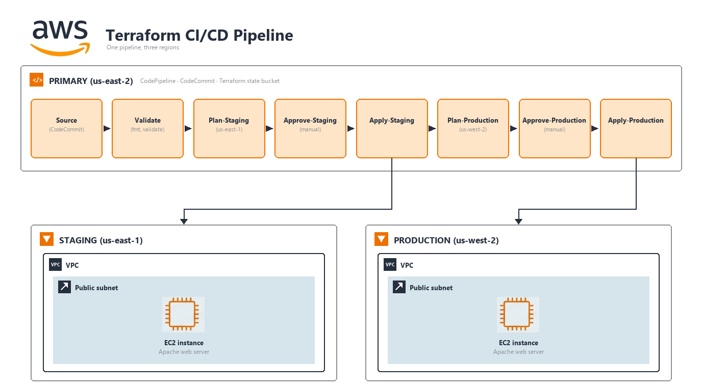

# Lab 3: Pipeline Operations

*Terraform Day 3: Enterprise Deployment & Operations*

| | |
|---|---|
| **Course** | Terraform on AWS (300-Level) |
| **Chapter** | CI/CD Pipelines for Multi-Region Deployment |
| **Duration** | 60 minutes |
| **Difficulty** | Advanced |
| **Version** | 3.2 |
| **Prerequisites** | Lab 1 completed (state bucket created and captured) |
| **Terraform** | >= 1.10.0 |
| **Lab Files** | [github.com/AWSClassroom-com/Advanced_Terraform](https://github.com/AWSClassroom-com/Advanced_Terraform) → `lab3/pipeline/`, `lab3/app-repo/` |
---

## Lab Overview

### Narrative

After a production incident in Days 1-2, your CTO mandated: *"No human runs terraform apply against production from their laptop."* The platform team built a CI/CD pipeline, but it has only been tested with simple SSM parameters.

Today, you'll push **real infrastructure** through the pipeline: a complete web application stack with VPC, networking, and EC2 instances. You'll deploy to staging (us-east-2), verify it works, approve, then promote to production (us-west-2). At the end, you'll tear down both environments through the pipeline -- demonstrating the full infrastructure lifecycle.

### What You'll Deploy

Each student deploys their own isolated infrastructure, tagged with their IAM username:

| Resource | Purpose |
|----------|---------|
| VPC (10.0.0.0/16) | Isolated network per student |
| Public Subnet | Hosts the web server |
| Internet Gateway | Enables internet access |
| Route Table | Routes traffic to IGW |
| Security Group | Allows HTTP (80) and SSH (22) |
| EC2 Instance | Apache web server |

### Learning Objectives

By the end of this lab, you will:

- **Deploy real infrastructure through a pipeline** (not just SSM parameters)
- **Experience multi-region promotion** (staging in us-east-2 → prod in us-west-2)
- **Verify deployments** by curling the web servers
- **Practice the approval workflow** with actual infrastructure at stake
- **Tear down through the pipeline** demonstrating full lifecycle management

---

## Architecture Overview



*Figure: The 8-stage CodePipeline deploys to staging (us-east-2) first, then promotes to production (us-west-2) after manual approval. Each environment gets its own isolated VPC with EC2 running Apache.*

---

## Task 1: Review Pipeline Infrastructure (10 min)

1. **Navigate to Pipeline Directory**

    ```bash
    cd ~/Advanced_Terraform/lab3/pipeline
    ls -la
    ```

    **Key files:**

    | File | Purpose |
    |------|---------|
    | `providers.tf` | Backend and AWS provider |
    | `variables.tf` | IAM username and bucket name |
    | `iam.tf` | IAM roles for CodeBuild and CodePipeline |
    | `codebuild.tf` | Build projects for validate, plan, apply |
    | `codepipeline.tf` | Pipeline stages with approval gates |
    | `outputs.tf` | Repository URL, pipeline name |

2. **Review the Pipeline Stages**

    ```bash
    cat codepipeline.tf
    ```

    **Notice the 8-stage flow:**

    1. **Source** - Polls CodeCommit for pushes to `main` (`PollForSourceChanges = "true"`)
    2. **Validate** - `terraform fmt -check` + `terraform validate`
    3. **Plan-Staging** - Plans for us-east-2, saves artifact
    4. **Approve-Staging** - Manual approval gate
    5. **Apply-Staging** - Applies saved plan to us-east-2
    6. **Plan-Production** - Plans for us-west-2, saves artifact
    7. **Approve-Production** - Manual approval gate
    8. **Apply-Production** - Applies saved plan to us-west-2

3. **Review the CodeBuild Projects**

    ```bash
    cat codebuild.tf
    ```

    Each pipeline stage runs in a CodeBuild project. `codebuild.tf` defines those projects and — critically — embeds the **buildspec** (the shell script CodeBuild runs) for each one. Don't run any terraform commands at this step; just read the file.

    Scroll through and find the **plan-stage buildspec** and the **apply-stage buildspec** inside `codebuild.tf`. You'll see this pattern:

    ```bash
    # plan-stage buildspec (inside codebuild.tf)
    terraform plan -out=tfplan

    # apply-stage buildspec (inside codebuild.tf, runs after the manual approval)
    terraform apply -auto-approve tfplan
    ```

    This is the **Golden Rule of Terraform automation**: the plan stage produces a binary plan artifact (`tfplan`), and the apply stage **executes that exact artifact** instead of re-planning. The approver reviews what `plan` produced; `apply` is then guaranteed to do exactly that — nothing else. If apply were to re-plan, state or AWS could have drifted between approval and execution, and the apply would silently run a different change than the one that was reviewed.
    4. **Review IAM Roles**

    ```bash
    cat iam.tf
    ```

    **Two roles with separate responsibilities:**

    | Role | Purpose |
    |------|---------|
    | CodePipeline Role | Orchestrates pipeline, triggers builds |
    | CodeBuild Role | Executes Terraform, creates AWS resources |

---

## Task 2: Deploy Pipeline Infrastructure (10 min)

> **Naming convention reminder.** Lab 3's pipeline stack uses **`student_id`** as its input variable (not `account` like Lab 2's lean VPC). It accepts either `^user[0-9]{2}$` (Lab 1's convention) or `^student[0-9]{2}$` — use the **same value you set in Lab 1** so the bucket name, CodeCommit repo, CodePipeline, and CodeBuild projects all share a consistent prefix (e.g., if Lab 1 used `user07`, use `user07` here too — every resource gets prefixed `user07-terraform-repo`, `user07-terraform-pipeline`, etc.).

5. **Configure Variables**

    ```bash
    cp terraform.tfvars.example terraform.tfvars
    ```

    Edit `terraform.tfvars`. Use the **same concrete ID you used in Lab 1** (Lab 1 only accepts `userNN`, so e.g. `user07`). The validator here accepts `userNN` or `studentNN`, but the literal placeholder `studentXX` is rejected — and using a different ID than Lab 1 would break the shared naming that Lab 4's dashboard depends on:

    ```hcl
    student_id        = "user07"                         # ← REPLACE 07 with YOUR assigned student number (same value you used in Lab 1)
    state_bucket_name = "user07-terraform-state-ab12cd"  # ← REPLACE with YOUR actual bucket name from Lab 1 `terraform output state_bucket_name`
    ```

6. **Configure Backend**

    Edit `providers.tf` with your S3 bucket:

    ```hcl
    backend "s3" {
      bucket       = "studentXX-terraform-state-SUFFIX"
      key          = "pipeline/terraform.tfstate"
      region       = "us-east-2"  # change to your assigned staging region if not us-east-2
      encrypt      = true
      use_lockfile = true
    }
    ```

7. **Deploy Pipeline**

    ```bash
    terraform init
    terraform plan
    terraform apply
    ```
    Review the plan, then type `yes` at the apply prompt. Expected: ~15 resources (CodeCommit, CodeBuild projects, CodePipeline, IAM roles, S3 artifacts bucket).

    **Note the outputs.** You'll use the CodeCommit clone URL in Task 3, and the pipeline name to find your pipeline in the AWS Console at the next step:

    ```
    repository_clone_url_http = "https://git-codecommit.us-east-2.amazonaws.com/v1/repos/studentXX-terraform-repo"
    pipeline_name            = "studentXX-terraform-pipeline"
    ```

    > **Don't click the `repository_clone_url_http` in a browser** — that's the CodeCommit HTTPS endpoint; it's reachable from `git clone` but a browser hit will prompt for a login. We'll use it via git in Task 3.

8. **Open the Pipeline in the AWS Console**

    Navigate manually (Terraform doesn't emit a console URL):

    1. AWS Console → **CodePipeline** → **Pipelines**
    2. Confirm you're in the **staging region** (top-right region picker) — that's where the pipeline lives. The `apply-prod` stage deploys *to* the prod region, but the pipeline itself runs in the staging region.
    3. Click your pipeline (`studentXX-terraform-pipeline` — the `pipeline_name` from the output above)
    4. You'll see the 8 stages laid out. They'll currently be in a failed/idle state — the CodeCommit repo is empty, so the source stage has nothing to flow through. Task 3 fixes that.

---

## Task 3: Push Web Application Code (10 min)

> **Three similar names — read this before you start.** Task 3 touches three things that all sound like "the app repo." Knowing which is which will save you 15 minutes of confusion.
>
> | Name | What it is | Where it lives |
> |---|---|---|
> | **`lab3/app-repo/`** | **Source** Terraform code (modules + per-environment wrappers) that ships with the course. You'll copy *from* here. | Subdirectory of the `Advanced_Terraform` GitHub repo you cloned at the start of the course (`~/Advanced_Terraform/lab3/app-repo/`). |
> | **`studentXX-terraform-repo`** | The empty **CodeCommit repository** that Task 2 created. The CodePipeline is wired to watch this repo for pushes. You'll push *to* here. | AWS-side, in your staging region. Listed in the Step 7 output as `repository_clone_url_http = .../repos/studentXX-terraform-repo`. |
> | **`webapp-repo`** | The **local working directory name** you'll give to the `git clone` of `studentXX-terraform-repo` in Step 10. Just a folder on your laptop — the name doesn't have to match the CodeCommit repo. We put it alongside `lab3/pipeline/` and `lab3/app-repo/` so everything for this lab lives in `~/Advanced_Terraform/lab3/`. | `~/Advanced_Terraform/lab3/webapp-repo/` after Step 10 runs. |
>
> **The flow:** clone `studentXX-terraform-repo` to local `webapp-repo/` (Step 10) → copy contents of `lab3/app-repo/` into `webapp-repo/` (Step 11) → commit & push from `webapp-repo/` back up to `studentXX-terraform-repo` on CodeCommit, which triggers the pipeline.

9. **Configure Git for CodeCommit**

    ```bash
    git config --global credential.helper '!aws codecommit credential-helper $@'
    git config --global credential.UseHttpPath true
    ```
    > **Note on `--global`:** AWS documents the credential helper as a global git config because the helper must be available before any clone. This is appropriate in a dedicated lab environment. In a shared workstation where you have multiple git providers, scope this to a `[includeIf "gitdir:~/work/codecommit/"]` block in `~/.gitconfig` instead, or unset both keys at end-of-session: `git config --global --unset credential.helper && git config --global --unset credential.UseHttpPath`.

10. **Clone the empty CodeCommit repository into a local working directory**

    This clones `studentXX-terraform-repo` (the CodeCommit repo) into a new local folder called `webapp-repo/` *inside* the `lab3/` directory — keeping it next to `lab3/pipeline/` and `lab3/app-repo/` so everything related to this lab lives under one roof. The trailing `webapp-repo` argument is just the local folder name — it doesn't change the CodeCommit repo's name on AWS.

    ```bash
    cd ~/Advanced_Terraform/lab3

    # Clone the empty CodeCommit repo (studentXX-terraform-repo) into a local dir named webapp-repo/
    git clone $(terraform -chdir=pipeline output -raw repository_clone_url_http) webapp-repo
    cd webapp-repo
    ```
    You should now be in `~/Advanced_Terraform/lab3/webapp-repo/` — an empty git working tree pointing at the CodeCommit repo.

11. **Copy the source Terraform from `lab3/app-repo/` into your clone**

    `lab3/app-repo/` (the course-supplied source) gets copied into `webapp-repo/` (your local clone of the CodeCommit repo). After this step, your CodeCommit clone has real content ready to commit and push.

    ```bash
    # You're in ~/Advanced_Terraform/lab3/webapp-repo/ from Step 10.
    cp -r ../app-repo/* .
    ls -la
    ```

    **Files copied** (modular layout — per-environment wrappers calling a shared module):

    | File | Purpose |
    |------|---------|
    | `environments/staging/main.tf` | Staging wrapper — `backend "s3"` block + AWS provider (us-east-2) + `module "app"` call with `environment = "staging"`. Exposes `public_ip`, `instance_id`, `vpc_id` outputs. |
    | `environments/prod/main.tf` | Prod wrapper — same shape, different region (us-west-2), different state key. Same outputs. |
    | `modules/app/main.tf` | Shared application module — VPC, public subnet, IGW, route table, route table association, security group, and EC2 instance running Apache. Mirrors the Day 1-2 pattern so the skills carry over directly. |
    | `modules/app/variables.tf` | Module inputs: `student_id`, `environment`, `instance_count` |
    | `modules/app/outputs.tf` | Module outputs: `public_ip`, `instance_id`, `vpc_id`, `api_url` (null for this module — populated by the bonus serverless module instead). |
    | `modules/app-serverless/` | **Bonus** — Lambda + API Gateway HTTP API. Drop-in replacement for `modules/app/` with the same interface. Used only if you do Task 8. |

    > **Why VPC + EC2 (and not just SSM parameters)?** A pipeline lab is most convincing when students can see real infrastructure come up. The deployed stack mirrors what Days 1-2 built — same `aws_vpc` / `aws_subnet` / `aws_security_group` / `aws_instance` shape — so the skills carry over directly. Apache writes a tiny `index.html` tagged with the environment and student ID, and the verification step is a `curl` against the public IP. ~$0.01/hr per instance — trivial for a 4-hour class.

12. **Review the directory layout you just copied in**

    ```bash
    # You're in ~/Advanced_Terraform/lab3/webapp-repo/ from Step 11.
    pwd
    find environments modules -type f
    ```

    Expected layout:

    ```
    environments/
      staging/main.tf              # staging wrapper — backend + provider + module "app" call + outputs
      prod/main.tf                 # prod wrapper — same shape, different region/keys
    modules/
      app/main.tf                  # shared module — VPC + subnet + IGW + RT + RTA + SG + EC2 (httpd)
      app/variables.tf             # module inputs: student_id, environment, instance_count
      app/outputs.tf               # public_ip, instance_id, vpc_id, api_url (null for EC2 module)
      app-serverless/main.tf       # BONUS: Lambda + API Gateway alternative
      app-serverless/variables.tf  # same interface as modules/app
      app-serverless/outputs.tf
      app-serverless/lambda/index.js
    ```

    > **Two modules, one interface.** Both `modules/app/` (EC2 main path) and `modules/app-serverless/` (bonus) accept the same inputs and expose the same outputs (`public_ip`, `api_url`, `instance_id`, `vpc_id`). For EC2: `public_ip` is set, `api_url` is null. For serverless: it flips. The wrapper outputs surface all four either way, so verification commands don't need to know which module is in use. You'll only touch `app-serverless/` if you do Task 8.

13. **Read the staging wrapper and the shared module**

    ```bash
    # Still in ~/Advanced_Terraform/lab3/webapp-repo/
    cat environments/staging/main.tf
    cat modules/app/main.tf
    cat modules/app/variables.tf
    ```

    Things to notice:

    - **`environments/staging/main.tf`** declares the `backend "s3"` block (state lands in your Lab 1 bucket at key `pipeline/staging/terraform.tfstate`), pins the AWS provider region to **us-east-2** (staging region), attaches `default_tags` including `Student = "studentXX"`, calls `module "app"` with `environment = "staging"`, and re-exposes the module outputs (`public_ip`, `instance_id`, `vpc_id`, `api_url`) so `terraform output public_ip` works from the wrapper.
    - **`environments/prod/main.tf`** is the same shape — different state key (`pipeline/prod/terraform.tfstate`), different provider region (**us-west-2**), `environment = "prod"`.
    - **`modules/app/main.tf`** deploys 7 resources per environment: `aws_vpc` (10.10.0.0/16 for staging, 10.20.0.0/16 for prod — avoids Day 1-2's 192.168.0.0/20), `aws_subnet`, `aws_internet_gateway`, `aws_route_table`, `aws_route_table_association`, `aws_security_group` (HTTP-only), and `aws_instance` (t3.micro running Apache). The `user_data` writes a tiny env-tagged `index.html` so `curl http://<public_ip>` returns proof the right environment deployed.

14. **Customize the staging and prod wrappers for your student ID + bucket**

    Both wrappers ship with placeholder strings (`studentXX`, `SUFFIX`) that you must replace with your actual values **before** committing. The bucket name comes from your Lab 1 `terraform output state_bucket_name`.

    **a. Edit the staging wrapper:**

    ```bash
    # Still in ~/Advanced_Terraform/lab3/webapp-repo/
    cd environments/staging
    pwd     # should print: <...>/lab3/webapp-repo/environments/staging
    ```

    Open `main.tf` in your editor. Replace **every occurrence** of:

    | Placeholder | Replace with |
    |---|---|
    | `studentXX` | your assigned student ID (e.g., `user07`) |
    | `studentXX-terraform-state-SUFFIX` | your actual Lab 1 bucket name (e.g., `user07-terraform-state-ab12cd`) |

    The places that need changing in `environments/staging/main.tf`:

    - `backend "s3" { bucket = "studentXX-terraform-state-SUFFIX" ... }`
    - `default_tags { tags = { Student = "studentXX" ... } }`
    - `module "app" { student_id = "studentXX" ... }`

    **b. Edit the prod wrapper:**

    ```bash
    cd ../prod
    pwd     # should print: <...>/lab3/webapp-repo/environments/prod
    ```

    Open `main.tf` here too and make the same three replacements. (The region differs from staging — leave that alone.)

    **c. Return to the repo root before committing:**

    ```bash
    cd ~/Advanced_Terraform/lab3/webapp-repo
    pwd     # should print: <...>/lab3/webapp-repo
    ```

15. **Push to CodeCommit**

    ```bash
    git checkout -b main
    git add .
    git commit -m "Initial web application - VPC + EC2 for staging and prod"
    git push -u origin main
    ```
    ---

## Task 4: Deploy to Staging (15 min)

16. **Watch Pipeline Execute**

    1. Return to the CodePipeline console
    2. Pipeline triggers automatically within 1-2 minutes
    3. Watch it progress through Source → Validate → Plan-Staging

17. **Handle Validate Failure (If Needed)**

    If Validate fails due to formatting:

    ```bash
    cd ~/Advanced_Terraform/lab3/webapp-repo
    terraform fmt -recursive
    git add .
    git commit -m "Fix terraform formatting"
    git push origin main
    ```
    18. **Review Staging Plan**

    When pipeline reaches **Plan-Staging**:

    1. Click **Details** on the Plan-Staging stage
    2. Click **View logs** to see the CodeBuild output
    3. Scroll to find the plan output:

    ```
    Plan: 7 to add, 0 to change, 0 to destroy.
    ```

    **Resources being created:**
    - 1 VPC
    - 1 Subnet
    - 1 Internet Gateway
    - 1 Route Table
    - 1 Route Table Association
    - 1 Security Group
    - 1 EC2 Instance

19. **Approve Staging Deployment**

    When pipeline reaches **Approve-Staging**:

    1. Click **Review**
    2. Comment: "Reviewed staging plan - creating VPC and EC2 in us-east-2"
    3. Click **Approve**

    Watch **Apply-Staging** execute. This takes ~2-3 minutes as the VPC and EC2 are created.

20. **Verify Staging Deployment**

    After Apply-Staging completes, get the staging public IP from the staging state. The state lives at key `pipeline/staging/terraform.tfstate` in your Lab 1 bucket — same bucket as Lab 1, separate key.

    ```bash
    # Get the staging public IP from the staging state file.
    aws s3 cp s3://studentXX-terraform-state-SUFFIX/pipeline/staging/terraform.tfstate - --region <bucket-region> | \
        jq -r '.outputs.public_ip.value'
    ```
    Replace `studentXX-terraform-state-SUFFIX` with your bucket name and `<bucket-region>` with the region your Lab 1 bucket lives in. (Alternatively, find the IP in the CodeBuild logs: Apply-Staging → View logs → scroll to the `terraform apply` outputs at the end.)

    **Verify the web server is up:**

    ```bash
    curl http://<STAGING_PUBLIC_IP>
    ```
    **Expected output:**

    ```html
    <h1>Sample Web App</h1>
    <p>Environment: staging</p>
    <p>Student: studentXX</p>
    <p>Deployed via CI/CD Pipeline</p>
    ```

    The HTML comes from the `user_data` script in `modules/app/main.tf` — Apache renders it at `/var/www/html/index.html` on first boot.

---

---

## Task 5: Inject Secrets via Parameter Store and Secrets Manager (15 min)

The pipeline you just deployed hardcodes everything — fine for a lab, dangerous in production. CodeBuild has first-class integration with both AWS Systems Manager Parameter Store and AWS Secrets Manager. Values are pulled at build start and exposed as environment variables; Secrets Manager values never appear in build logs.

This task wires both into the existing buildspec so the pipeline can deploy environment-specific config and credentials without anything sensitive landing in source control.

21. **Store a non-sensitive value in Parameter Store**

    Parameter Store is good for environment-specific config — region, account number, feature-flag toggles, hostnames. Values are visible to anyone with `ssm:GetParameter` and appear in CloudTrail.

    > **Set `$STUDENT` first — do not use `$USER`.** On the lab EC2 box `$USER` is `ec2-user`, not your assigned ID. Step 23 wires the buildspec to `/studentXX/lab3/...`, so these paths must match exactly or CodeBuild cannot resolve the value at build start:
    >
    > ```bash
    > export STUDENT="studentXX"   # your assigned ID — same value as student_id in Step 5
    > ```

    ```bash
    aws ssm put-parameter \
        --name "/${STUDENT}/lab3/db_host" \
        --type "String" \
        --value "rds.${STUDENT}.example.com" \
        --overwrite
    ```
    Verify:

    ```bash
    aws ssm get-parameter --name "/${STUDENT}/lab3/db_host" --query 'Parameter.Value' --output text
    ```
    22. **Store a credential in Secrets Manager**

    Secrets Manager is for values that must NEVER appear in plaintext logs. It encrypts at rest with KMS, supports automatic rotation, and CodeBuild masks the value in build output.

    ```bash
    aws secretsmanager create-secret \
        --name "${STUDENT}/lab3/db_password" \
        --description "Lab 3 demo credential — delete at end of lab" \
        --secret-string "demo-password-do-not-reuse"
    ```
    > **Cost note.** Secrets Manager charges $0.40/secret/month plus $0.05 per 10,000 API calls. For a lab account with 25 students × 1 secret = $10/month if forgotten — destroy at end of lab (Cleanup task).

23. **Update the plan-staging buildspec to pull both values**

    > **Why the *plan* stage, not the apply stage?** The apply stage runs `terraform apply tfplan` against a **saved plan file**, and Terraform refuses to accept variables alongside a saved plan (`Error: Can't set variables when applying a saved plan file`) — a saved plan already contains the variable values that were set when it was created. So the secrets have to be resolved at **plan** time and baked into `tfplan`. That is also the safer design: the values the approver reviews in the plan are exactly the values that get applied.

    The buildspecs live inline in `lab3/pipeline/codebuild.tf`. Find the `plan_staging` project and add an `env:` block directly under `version: 0.2`, above `phases:`:

    ```yaml
    version: 0.2
    env:
      parameter-store:
        DB_HOST: /studentXX/lab3/db_host
      secrets-manager:
        DB_PASSWORD: studentXX/lab3/db_password
    phases:
      ...
    ```
    Replace `studentXX` with your assigned student ID — the same value you exported as `$STUDENT` in Step 21 and set as `student_id` in Step 5. CodeBuild fetches both values at build start, before any command runs; `$DB_HOST` and `$DB_PASSWORD` are then available to every command in `phases:`.

    > **This uses the CodeBuild service role, not your IAM user.** The `env:` block is resolved by CodeBuild itself using `aws_iam_role.codebuild` from `lab3/pipeline/iam.tf`. That role grants `ssm:*` and `secretsmanager:GetSecretValue` — if you scope it down later, the `env:` block is the thing that breaks first, and it fails *before* any build command runs.

24. **Export the values as `TF_VAR_*` so the plan picks them up**

    Still in the `plan_staging` buildspec, set the two Terraform variables from the CodeBuild env vars just before the plan runs:

    ```yaml
    phases:
      build:
        commands:
          - echo "=== Planning staging environment ==="
          - cd environments/staging
          - export TF_VAR_db_host="$DB_HOST"
          - export TF_VAR_db_password="$DB_PASSWORD"
          - terraform init
          - terraform plan -out=tfplan
          - echo "=== Staging plan complete ==="
    ```
    Terraform reads any `TF_VAR_<name>` environment variable as the value for `variable "<name>"`. **Leave the apply-stage buildspec exactly as it is** — `terraform apply -auto-approve tfplan` already carries these values inside the plan file.

25. **Declare and consume the variables in the staging wrapper**

    The variables have to be declared in the directory Terraform actually runs in — that's `environments/staging/`, not the repo root. Open `environments/staging/main.tf` in your `webapp-repo` clone and add:

    ```hcl
    variable "db_host" {
      description = "Database hostname injected from Parameter Store via the pipeline."
      type        = string
      default     = "unset"
    }

    variable "db_password" {
      description = "Database password injected from Secrets Manager via the pipeline."
      type        = string
      sensitive   = true
      default     = "unset"
    }

    # Proves the injection worked: check this parameter in the console after the
    # pipeline runs and you'll see the Parameter Store value that CodeBuild fetched.
    resource "aws_ssm_parameter" "db_config" {
      name  = "/studentXX/staging/db-endpoint"
      type  = "String"
      value = var.db_host
    }
    ```
    Replace `studentXX` with your student ID. Two things to notice:

    - **`sensitive = true`** keeps `db_password` out of `terraform plan` output and out of any plaintext output — Terraform prints `(sensitive value)` instead.
    - **The `default = "unset"`** matters. Plan-Prod and the Validate stage run against code that has no `TF_VAR_db_*` set; without defaults those stages would fail with "No value for required variable."

26. **Re-apply the pipeline and push the wrapper changes**

    Apply the updated CodeBuild project so the new buildspec takes effect:

    ```bash
    cd ~/Advanced_Terraform/lab3/pipeline
    terraform apply
    ```
    Then commit and push your `webapp-repo` updates:

    ```bash
    cd ~/Advanced_Terraform/lab3/webapp-repo
    git add environments/staging/main.tf
    git commit -m "Consume pipeline-injected db_host and db_password in staging"
    git push origin main
    ```
    27. **Verify in the Plan-Staging build log**

    Open the CodeBuild console for your **plan-staging** project (not apply — that's where the `env:` block now lives). In the build log:

    - `[Container] env DB_HOST = rds.studentXX.example.com` — the Parameter Store value, visible
    - `[Container] env DB_PASSWORD = ***` — Secrets Manager values are masked, never logged

    The `terraform plan` output shows `db_host = "rds.studentXX.example.com"` but `db_password = (sensitive value)` because of the `sensitive = true` flag. After the pipeline finishes, confirm the parameter the pipeline created:

    ```bash
    aws ssm get-parameter --name "/${STUDENT}/staging/db-endpoint" \
        --query 'Parameter.Value' --output text --region us-east-2
    ```

    > **In production, scope tighter.** The CodeBuild role in `lab3/pipeline/iam.tf` grants `ssm:*` and `secretsmanager:GetSecretValue` on `*`. For real workloads, scope `secretsmanager:GetSecretValue` to the specific secret ARN and `ssm:GetParameter*` to the specific parameter path prefix. Use `aws:ResourceTag` condition keys to limit by environment.

---

## Task 6: Promote to Production (10 min)

28. **Review Production Plan**

    After staging apply completes, the pipeline automatically runs **Plan-Production**:

    1. Click **Details** on Plan-Production
    2. View the plan in CodeBuild logs
    3. Verify it's creating the same 7 resources in **us-west-2**

29. **Approve Production Deployment**

    When pipeline reaches **Approve-Production**:

    1. Click **Review**
    2. Comment: "Staging verified. Approving production deployment to us-west-2"
    3. Click **Approve**

    Watch **Apply-Production** execute.

30. **Verify Production Deployment**

    Same flow as Step 20, but reading from the prod state key (`pipeline/prod/...`):

    ```bash
    aws s3 cp s3://studentXX-terraform-state-SUFFIX/pipeline/prod/terraform.tfstate - --region <bucket-region> | \
        jq -r '.outputs.public_ip.value'
    ```
    Then curl the prod web server:

    ```bash
    curl http://<PROD_PUBLIC_IP>
    ```
    **Expected output:**

    ```html
    <h1>Sample Web App</h1>
    <p>Environment: prod</p>
    <p>Student: studentXX</p>
    <p>Deployed via CI/CD Pipeline</p>
    ```

    Same content as staging, only the `Environment` line differs. **You now have identical infrastructure in two regions**, deployed through an automated pipeline with approval gates.

---

## Task 7: Verify in AWS Console (5 min)

31. **Check Your Resources**

    **Staging (us-east-2):**

    1. Switch to us-east-2 region
    2. EC2 → Instances → Filter by tag: `Student = studentXX`
    3. VPC → Your VPCs → Filter by tag: `Student = studentXX`

    **Production (us-west-2):**

    1. Switch to us-west-2 region
    2. Repeat the same checks

    **All resources should be tagged with your IAM username** for easy identification in the shared account.

---

## Task 8: Bonus — Promote to Serverless (Optional, 15 min)

> **Skip this task if you're running short on time** — proceed directly to Task 9 (Cleanup). The main lab is complete after Task 7. This bonus task demonstrates that swapping the deployed *payload* (EC2 → Lambda + API Gateway) requires changing **one line per environment** when the modules share an interface — and it gives students who finished early a tangible "modern serverless" experience to compare against the EC2 path.

32. **Swap both environments to the serverless module**

    The `app-repo/` ships a second module — `modules/app-serverless/` — that accepts the same inputs (`student_id`, `environment`) and exposes the same outputs (with `api_url` populated instead of `public_ip`). Edit each environment wrapper to point at it:

    ```bash
    # You're cleaning up later — be in the webapp-repo root first.
    cd ~/Advanced_Terraform/lab3/webapp-repo
    pwd     # confirm: <...>/lab3/webapp-repo
    ```

    Edit `environments/staging/main.tf` — change exactly **one line**:

    ```diff
      module "app" {
    -   source      = "../../modules/app"
    +   source      = "../../modules/app-serverless"
        student_id  = "studentXX"
        environment = "staging"
      }
    ```
    Then make the same change in `environments/prod/main.tf`.

33. **Commit, push, and verify the serverless deploy**

    ```bash
    git add environments/staging/main.tf environments/prod/main.tf
    git commit -m "Bonus: switch app module to Lambda + API Gateway"
    git push origin main
    ```
    The pipeline triggers automatically. The plan diff will show roughly **7 resources to destroy (VPC, subnet, IGW, RT, RTA, SG, EC2) and ~8 to add (IAM role + policy attachment, log group, Lambda function, API, integration, route, stage, permission)**. Approve both stages.

    Verify the new endpoint. The `api_url` output replaces `public_ip` in the new state:

    ```bash
    aws s3 cp s3://studentXX-terraform-state-SUFFIX/pipeline/staging/terraform.tfstate - --region <bucket-region> | \
        jq -r '.outputs.api_url.value'
    ```
    Curl the URL:

    ```bash
    curl <staging api_url>
    ```
    **Expected output:**

    ```html
    <h1>Sample Web App (Serverless)</h1>
    <p>Environment: staging</p>
    <p>Student: studentXX</p>
    <p>Deployed via Lambda + API Gateway HTTP API</p>
    ```

    Same shape as the EC2 path — only the heading and "Deployed via..." line change. Repeat for prod (use `pipeline/prod/terraform.tfstate`).

    > **What you just demonstrated.** Because both modules share an input/output interface, the pipeline didn't need to change at all. The Plan-Staging/Apply-Staging/Plan-Production/Apply-Production stages run identically — only the resources they manage are different. This is the practical payoff of designing module interfaces around stable contracts rather than the underlying technology.

---

## Task 9: Cleanup Through Pipeline (Optional but Recommended)

34. **Trigger Destroy**

    The pipeline has no destroy stage — its eight stages are Source, Validate, Plan-Staging, Approve-Staging, Apply-Staging, Plan-Production, Approve-Production, Apply-Production. Tear down from the CLI instead.

    **Option A: Manual destroy from CLI**

    ```bash
    # Destroy staging
    cd ~/Advanced_Terraform/lab3/webapp-repo/environments/staging
    terraform init
    terraform destroy -auto-approve

    # Destroy production
    cd ~/Advanced_Terraform/lab3/webapp-repo/environments/prod
    terraform init
    terraform destroy -auto-approve
    ```
    **Option B: Push a destroy change**

    Edit the Terraform code to remove resources, push, and let pipeline apply the changes.

35. **Verify Cleanup**

    Verify no instances remain (regardless of whether you ran the bonus or stayed on EC2):

    ```bash
    # EC2 instances tagged with your student ID — should return empty after destroy.
    aws ec2 describe-instances \
        --filters "Name=tag:Student,Values=studentXX" "Name=instance-state-name,Values=running" \
        --query 'Reservations[*].Instances[*].[InstanceId,Tags[?Key==`Name`].Value|[0]]' \
        --output table \
        --region us-east-2

    aws ec2 describe-instances \
        --filters "Name=tag:Student,Values=studentXX" "Name=instance-state-name,Values=running" \
        --query 'Reservations[*].Instances[*].[InstanceId,Tags[?Key==`Name`].Value|[0]]' \
        --output table \
        --region us-west-2
    ```
    If you ran the Bonus task and deployed Lambda/API Gateway instead, also confirm those are gone:

    ```bash
    aws lambda list-functions --region us-east-2 --query 'Functions[?starts_with(FunctionName, `studentXX-`)].FunctionName' --output text
    aws lambda list-functions --region us-west-2 --query 'Functions[?starts_with(FunctionName, `studentXX-`)].FunctionName' --output text
    ```
    Both should return empty after destroy.

36. **Delete the Task 5 secret and parameter**

    These were created by CLI, not Terraform, so `terraform destroy` does not remove them. Secrets Manager bills $0.40/secret/month until the deletion window closes.

    ```bash
    # $STUDENT was exported in Step 21
    aws secretsmanager delete-secret         --secret-id "${STUDENT}/lab3/db_password"         --force-delete-without-recovery

    aws ssm delete-parameter --name "/${STUDENT}/lab3/db_host"
    ```

---

## Lab Complete!

You have successfully:

- Deployed a CI/CD pipeline for Terraform
- Pushed **real infrastructure** (VPC + EC2) through the pipeline
- Deployed to **staging (us-east-2)** and verified
- Approved and promoted to **production (us-west-2)**
- Verified both environments with curl
- Cleaned up resources through the pipeline

### Key Takeaways

| Concept | What You Experienced |
|---------|---------------------|
| **Golden Rule** | Plan saved as artifact, apply uses saved plan |
| **Multi-region deployment** | Same code deployed to us-east-2 and us-west-2 |
| **Approval gates** | Manual review before each environment |
| **Student isolation** | All resources tagged with your IAM username |
| **Full lifecycle** | Create → verify → destroy through pipeline |

### Connection to Chapters

| Chapter | Lab Experience |
|--------|----------------|
| Chapter 1 (State) | Separate state per environment (staging/prod) |
| Chapter 2 (Import) | Contrast: Import is for existing infra; pipeline is for new infra |
| Chapter 3 (Pipeline) | Full implementation of 6-stage pattern |

---

## Troubleshooting

### Pipeline Stuck on Source

CodeCommit polling runs about once a minute, so give it 1-2 minutes after a push. Impatient? Click **Release change** in the pipeline console to start it immediately.

> **Why polling and not an event?** A CodePipeline created through the console gets an EventBridge rule for push-triggering created for it automatically. One created through the API — which is what Terraform does — does not, and the API default for `PollForSourceChanges` is `false`. `lab3/pipeline/codepipeline.tf` sets it to `"true"` explicitly so pushes trigger the pipeline without a separate EventBridge rule and its IAM role. In production you would prefer the EventBridge rule: it fires in seconds instead of up to a minute, and it does not burn a polling API call every minute forever.

### Validate Fails

```bash
terraform fmt -recursive
git add . && git commit -m "Fix formatting" && git push origin main
```
### Apply Fails with Permission Error

Check CodeBuild logs for the specific permission needed. The IAM role may need additional policies for EC2/VPC resources.

### Can't Find Your Resources

Filter by tag: `Student = studentXX` in the AWS console.

### EC2 Instance Not Accessible

1. Check security group allows HTTP (port 80)
2. Check route table has route to IGW
3. Verify instance is in "running" state

---

## Lab Completion Checklist

- [ ] Deployed pipeline infrastructure (~15 resources)
- [ ] Cloned CodeCommit repository
- [ ] Pushed web application Terraform code
- [ ] Observed pipeline trigger automatically
- [ ] Reviewed Plan-Staging output (7 resources)
- [ ] Approved Staging deployment
- [ ] Verified staging with curl (us-east-2)
- [ ] Reviewed Plan-Prod output (7 resources)
- [ ] Approved Production deployment
- [ ] Verified production with curl (us-west-2)
- [ ] Confirmed resources tagged with IAM username
- [ ] Cleaned up (destroyed) both environments

---

## Cost Considerations

| Resource | Cost | Duration |
|----------|------|----------|
| EC2 (t3.micro) x 2 | ~$0.02/hour | Lab duration |
| VPC, Subnet, IGW | Free | - |
| CodePipeline | $1/month | Prorated |
| CodeBuild | ~$0.005/minute | ~10 min total |

**Total estimated cost:** < $0.10 for the lab

**Important:** Destroy resources at the end to avoid ongoing charges.

---

## End of Day: Complete Cleanup

```bash
# 1. Destroy web application (staging)
cd ~/Advanced_Terraform/lab3/webapp-repo/environments/staging
terraform init -backend-config="bucket=studentXX-terraform-state-SUFFIX"
terraform destroy -auto-approve

# 2. Destroy web application (prod)
cd ~/Advanced_Terraform/lab3/webapp-repo/environments/prod
terraform init -backend-config="bucket=studentXX-terraform-state-SUFFIX"
terraform destroy -auto-approve

# 3. Destroy pipeline infrastructure
cd ~/Advanced_Terraform/lab3/pipeline
terraform destroy -auto-approve

# 4. Verify no running instances
aws ec2 describe-instances \
    --filters "Name=tag:Student,Values=studentXX" "Name=instance-state-name,Values=running" \
    --query 'Reservations[*].Instances[*].InstanceId' \
    --output text \
    --region us-east-2

aws ec2 describe-instances \
    --filters "Name=tag:Student,Values=studentXX" "Name=instance-state-name,Values=running" \
    --query 'Reservations[*].Instances[*].InstanceId' \
    --output text \
    --region us-west-2
```
---

## Additional Resources

| Resource | URL |
|---|---|
| AWS CodePipeline | https://docs.aws.amazon.com/codepipeline/latest/userguide/ |
| AWS CodeBuild | https://docs.aws.amazon.com/codebuild/latest/userguide/ |
| Terraform CI/CD | https://developer.hashicorp.com/terraform/tutorials/automation |
| Multi-Region Deployment | https://developer.hashicorp.com/terraform/tutorials/automation/automate-terraform |
