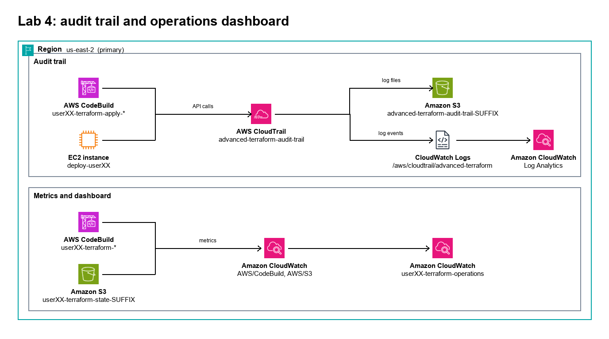

# Lab 4: Auditing & Observability

*Terraform Day 3: Enterprise Deployment & Operations*

| | |
|---|---|
| **Course** | Terraform on AWS (300-Level) |
| **Chapter** | Enterprise Operations |
| **Duration** | 30 minutes |
| **Difficulty** | Advanced |
| **Version** | 2.2 |
| **Prerequisites** | Labs 1-3 completed; Terraform 1.10+ |
| **Lab Files** | [github.com/AWSClassroom-com/Advanced_Terraform](https://github.com/AWSClassroom-com/Advanced_Terraform) → `lab4/observability/` |
---

## Lab Overview

### Narrative

Your SOC 2 auditor arrives next month. During the pre-audit call, the lead auditor asks a pointed question: *"Can you show me exactly who deployed what infrastructure, when, and through what mechanism?"*

You pause. Today your platform team has built an impressive enterprise Terraform workflow: centralized state (Lab 1), imported legacy infrastructure (Lab 2), and automated CI/CD with approval gates (Lab 3). But the auditor's question exposes the final gap: **operational visibility**.

You need to demonstrate:

- **Complete audit trail** -- every Terraform API call captured
- **Pipeline vs. manual distinction** -- prove production changes flow through the pipeline
- **Ongoing monitoring** -- a dashboard the SOC team can review anytime

    This lab closes that gap.

    ### Learning Objectives

    By the end of this lab, you will:

    - Query CloudTrail Event History to identify Terraform API calls
    - Distinguish pipeline-initiated changes from manual console/CLI activity
    - Build reusable CloudWatch Log Insights queries for audit reporting
    - Deploy a CloudWatch dashboard for operational visibility
    - Articulate how Labs 1-4 form a complete SOC 2-ready Terraform workflow

---

## Architecture Overview



*Figure: The observability layer provides three capabilities: CloudTrail for audit trail, Log Insights for queries, and CloudWatch Dashboard for real-time visibility.*

### Key Concepts

| Concept | Why It Matters |
|---------|----------------|
| **CloudTrail** | Records every AWS API call -- immutable audit trail |
| **User Agent** | Terraform sends a `Terraform/<version>` token in user agent — distinguishes from console |
| **Source IP** | `codebuild.amazonaws.com` for pipeline-originated calls vs. your IP for laptop-originated |
| **userIdentity.arn** | Identifies which CodeBuild project (or which IAM user) made the call |

---

## Task 1: CloudTrail Query Demo (10 min)

Every API call from Labs 1-3 was recorded by CloudTrail. Let's trace that activity.

1. **Navigate to CloudTrail**

    1. Open the **AWS Console**.
    2. Search for **CloudTrail**.
    3. Click **Event history** in the left sidebar.

2. **Filter for Terraform Activity**

    Try these filters one at a time. Each filter uses CloudTrail Event history's **Lookup attributes**:

    **Filter 1: SSM Parameter Changes**
    - Lookup attribute: **Event name**
    - Value: `PutParameter`

    **Filter 2: By Pipeline Role** (this only works if Lab 3's pipeline has executed)
    - Lookup attribute: **User name**
    - Value: `studentXX-codebuild-terraform-role` *(replace `studentXX` with your assigned student ID — same value you used for `student_id` in Labs 1 and 3)*

    **Filter 3: State Object Writes**
    - Lookup attribute: **Event name**
    - Value: `PutObject`

    For Filter 3, look for events where the **Resource name** column includes your state bucket (`studentXX-terraform-state-SUFFIX`).

    > **If you see no events:** CloudTrail Event history retains the most recent 90 days of management events for free, but events take **up to 15 minutes** to appear after the underlying API call. If Labs 1-3 finished within the last 15 minutes, wait and refresh.

    3. **Examine an Event**

    Click any **PutParameter** event → **View event**.

    **Key fields for auditors:**

    | Field | Example | What it tells you |
    |-------|---------|-------------------|
    | `userIdentity.arn` | `arn:aws:sts::<account>:assumed-role/studentXX-codebuild-terraform-role/<session>` | Which CodeBuild role was active for this call |
    | `userAgent` | A string containing `APN/1.0 HashiCorp/1.0 Terraform/1.10.x` | Confirms a Terraform-originated operation |
    | `sourceIPAddress` | `codebuild.amazonaws.com` (when CodeBuild made the call directly) or a public IP if from a workstation | Pipeline vs. manual differentiation |
    | `eventTime` | `2026-05-03T14:33:45Z` | Exact UTC timestamp |

    > **Reality check on `sourceIPAddress`:** When an API call originates from inside an AWS-managed service (like CodeBuild) and is signed by an assumed role, `sourceIPAddress` typically appears as the service's hostname (e.g., `codebuild.amazonaws.com`). When the same role is assumed from a workstation, `sourceIPAddress` will be the workstation's public IP. CloudTrail doesn't lie about this — but the value depends on **where the SDK/CLI ran**, not just **which role signed**.
    4. **Compare Pipeline vs. Console Activity**

    Find two events of the same type (`PutParameter` is a good one) and compare:

    | Field | Pipeline activity | Console / CLI activity |
    |-------|-------------------|------------------------|
    | `sourceIPAddress` | `codebuild.amazonaws.com` | Your public IP, or `console.amazonaws.com` for some console-routed calls |
    | `userAgent` | Contains `Terraform/1.10.x` | Contains `aws-cli/<version>` or browser User-Agent strings via console |
    | `userIdentity.arn` | Assumed-role of the CodeBuild role | Your IAM user ARN |

    > **Auditor's question answered:** *"Were all production changes made through the pipeline?"*
    >
    > **Your answer:** *"Yes — every production-targeted event in this time window has `userIdentity.arn` matching the `studentXX-codebuild-terraform-role` and `userAgent` containing `Terraform/`."*

---

## Task 2: CloudWatch Log Insights (5 min)

CloudTrail Event history works for one-off investigations. **CloudWatch Logs Insights** runs SQL-like queries across thousands of events at once — but only if CloudTrail is configured to deliver to a log group.

5. **Navigate to Logs Insights**

    1. Open **CloudWatch**.
    2. Expand **Logs** → click **Logs Insights**.

6. **Select the CloudTrail Log Group**

    Pick the CloudTrail log group from the dropdown. Set the time range to **Last 12 hours**.

    > **If no CloudTrail log group exists:** the org's CloudTrail trail isn't sending events to CloudWatch Logs (only to S3 / Event history). Skip to Task 3 — the dashboard still works without Logs Insights, and Event history covers the same 90 days.

7. **Run a Terraform Activity Query**

    Paste this query and click **Run**:

    ```
    fields @timestamp, eventName, userIdentity.arn, sourceIPAddress
    | filter userAgent like /Terraform/
    | sort @timestamp desc
    | limit 50
    ```
    This returns the 50 most recent events whose user agent contains "Terraform" — i.e., everything any Terraform binary did, regardless of which IAM principal ran it.

    **Expected result** (one row per event, sample):

    | @timestamp | eventName | userIdentity.arn | sourceIPAddress |
    |---|---|---|---|
    | 2026-05-14 15:42:11 | PutObject | arn:aws:sts::123…:assumed-role/student07-codebuild-terraform-role/apply-staging | codebuild.amazonaws.com |
    | 2026-05-14 15:42:09 | GetBucketVersioning | arn:aws:sts::123…:assumed-role/student07-codebuild-terraform-role/apply-staging | codebuild.amazonaws.com |
    | 2026-05-14 15:41:55 | CreateLogStream | arn:aws:iam::123…:user/student07 | 52.x.x.x |

    The mix is what you want to see — most rows should have a `codebuild-terraform-role` ARN (= pipeline-driven); a row with your IAM-user ARN (= someone ran `terraform apply` from their laptop, breaking the Golden Rule) is the kind of anomaly the lab's audit story is built around.

8. **Run a Resource-Scoped Query**

    ```
    fields @timestamp, eventName, requestParameters.name
    | filter eventSource = "ssm.amazonaws.com"
    | filter eventName in ["PutParameter", "DeleteParameter"]
    | filter requestParameters.name like /studentXX/
    | sort @timestamp desc
    | limit 20
    ```
    Replace `studentXX` with your assigned student ID. This narrows to SSM parameter operations on resources whose name contains your ID.

    **Expected result** (sample):

    | @timestamp | eventName | requestParameters.name |
    |---|---|---|
    | 2026-05-14 16:01:22 | PutParameter | /student07/lab3/db_host |
    | 2026-05-14 16:01:18 | PutParameter | /student07/lab3/db_password |

    Empty result is also valid — it just means no SSM parameter operations have happened for your student ID during the time window you selected. Expand the time range (top right of the Logs Insights console) to confirm.

9. **Save the Query**

    1. Click **Save**.
    2. Name: `studentXX-terraform-activity`.
    3. Click **Save**.

    Your SOC team can re-run this query anytime without remembering the syntax.

---

## Task 3: Deploy the Observability Dashboard (15 min)

Queries answer specific questions. Your ops team needs an always-on dashboard.

10. **Navigate to the Dashboard Directory**

    ```bash
    cd ~/Advanced_Terraform/lab4/observability
    ls -la
    ```
    11. **Review the Configuration Files**

    ```bash
    cat dashboard.tf | head -40
    ```

    The dashboard provisions a single `aws_cloudwatch_dashboard` resource named `${account}-terraform-operations`. Its widgets monitor:

    | Widget | Metric source | What it shows |
    |--------|---------------|---------------|
    | CodeBuild Duration | `AWS/CodeBuild` namespace, `Duration` metric | Build execution time across the 5 pipeline projects |
    | Build Success vs. Failure | `AWS/CodeBuild`, `SucceededBuilds` + `FailedBuilds` | Apply-stage outcomes for staging and prod |
    | Pipeline Execution Counters | `AWS/CodePipeline`, `PipelineExecutionSucceeded` + `PipelineExecutionFailed` | Cumulative pass/fail for `${account}-terraform-pipeline` |
    | Pipeline Execution Time Series | Same metrics, stacked area | Trend over time |
    | State Bucket Operations | `AWS/S3`, `GetRequests` + `PutRequests` on `var.state_bucket_name` | Reads (plans) vs. writes (applies) on the state bucket |
    | State Lockfile Activity | `AWS/S3`, `PutRequests` on `var.state_bucket_name` with FilterId `lockfile-activity` | Lock acquisition / release events (Terraform 1.10+ S3 native locking) |
    | Quick Links | Static markdown widget | Direct links to CodePipeline, CodeBuild, CloudTrail, S3, Logs Insights |
    | Audit Query Reference | Static markdown widget | Three CloudTrail Logs Insights query templates |

    > **About the "State Lockfile Activity" widget:** Lab 1 configures the S3 backend with `use_lockfile = true` (Terraform 1.10+ S3 native locking) — locks are S3 objects with a `.tflock` suffix, not DynamoDB items. The patched dashboard's lockfile widget references a CloudWatch metric `FilterId` named `lockfile-activity` — and that filter is created by **Appendix A**, not by the default `dashboard.tf`. **Until you apply Appendix A, this widget will show "No data" — that's expected, not a bug.** Appendix A adds an `aws_s3_bucket_metric` resource on your state bucket so the widget has metrics to display.
    12. **Configure Variables**

    ```bash
    # You're in ~/Advanced_Terraform/lab4/observability/ from Step 10.
    cp terraform.tfvars.example terraform.tfvars
    ```
    Edit `terraform.tfvars` and set all three required variables:

    ```hcl
    region            = "us-east-2"                            # Whatever region your instructor assigned (e.g., us-east-2)
    account           = "studentXX"                            # IMPORTANT: same value you used as student_id in Labs 1 and 3 — see naming-convention callout below
    state_bucket_name = "studentXX-terraform-state-SUFFIX"     # Exact bucket name from Lab 1 outputs
    ```
    > **Naming convention.** Lab 4's stack declares its input variable as `account` (matching Lab 2's lean VPC pattern), but the dashboard's CloudWatch widgets reference Lab 3 resources by name — e.g., `${var.account}-terraform-validate`. Lab 3 created those resources using `var.student_id`. **For the dashboard to actually find Lab 3's CodeBuild projects and pipeline, set `account` here to the same value you used as `student_id` in Labs 1 and 3.** The example file ships with `account = "userxx"` as a placeholder — overwrite it with your `studentXX` value.

    > **Bucket name handling:** `dashboard.tf` uses `var.state_bucket_name` directly, so the S3 widgets read from whatever bucket name you paste — Lab 1's random-suffix bucket works as-is, no edits to the dashboard code required.

    > **Don't edit `providers.tf`.** The backend block in that file is intentionally *partial* — it declares the `key`, `encrypt`, and `use_lockfile` settings but leaves `bucket` and `region` out, so they get supplied at `terraform init` time via `-backend-config` flags (Step 13). This matches the pattern Lab 3's `lab3/pipeline/providers.tf` uses and keeps the same file portable across students and regions.

    > **Region hard-coded in `dashboard.tf`:** the widget JSON inside `dashboard.tf` hard-codes `"us-east-2"` in nine places (each widget's `region` field plus the `dashboard_url` output and Quick Links). If your assigned region is **not** `us-east-2`, the dashboard will render but every widget will show "No data" because the metrics live in your actual region. Workarounds: (1) deploy this lab to `us-east-2` explicitly even if other labs ran elsewhere, or (2) before `terraform apply`, search-and-replace `us-east-2` with your region in `dashboard.tf`. Option (1) is simpler for class.

    > **State bucket region ≠ deploy region.** The S3 backend's `region` setting names the **bucket's** region, *not* the region where the resources are being deployed. They're independent. A team can keep state in `us-east-1` for audit and deploy resources to `us-west-2` — the backend `region` would still be `us-east-1` because that's where the bucket lives. In Step 13, pass the region your Lab 1 bucket was created in (run `aws s3api get-bucket-location --bucket <your-state-bucket-name>` if you're unsure — note that a `None`/`null` response means `us-east-1`, an AWS quirk).

13. **Deploy the Dashboard**

    Initialize with explicit backend bucket and region — `providers.tf` expects both at init time, not in the file:

    ```bash
    terraform init \
        -backend-config="bucket=<your-state-bucket-name>" \
        -backend-config="region=<state_bucket_region>"
    ```
    Use **the same bucket name you put in `terraform.tfvars`** and the **bucket's** region (not necessarily your deploy region — see callout above). Expected output ends with: `Terraform has been successfully initialized!`

    ```bash
    terraform plan
    ```
    Review the plan output. When it looks correct, run apply:

    ```bash
    terraform apply
    ```
    Type `yes` when prompted. Expected: **1 resource added** (the CloudWatch dashboard).

14. **View the Dashboard**

    ```bash
    terraform output dashboard_url
    ```
    Open the URL in your browser. You should see the widget rows described in Step 11.

    > **Note on data freshness:** CloudWatch metrics for new resources take **5-10 minutes** to populate. If a widget shows "No data" immediately after deploy, give it time and refresh. If it's still empty after 30 minutes, verify the bucket name in `terraform.tfvars` actually matches your Lab 1 `terraform output` value — the widgets are reading from whatever bucket you named.

---

## Task 4: What We Built Today

### The Day 3 Transformation

| Lab | Problem solved | Enterprise capability gained |
|-----|---------------|------------------------------|
| **Lab 1** | Engineers overwriting each other's state | Team-safe remote state with native locking |
| **Lab 2** | Legacy infrastructure outside Terraform | All infrastructure-as-code, zero downtime import |
| **Lab 3** | `terraform apply` from laptops | Automated, auditable, multi-region deployments |
| **Lab 4** | "Who deployed what?" unanswerable | Operational visibility and audit-ready compliance |

### SOC 2 Readiness

When the auditor arrives, you can demonstrate:

- **Change Management:** All production changes flow through CodePipeline with manual approval gates (Lab 3).
- **Audit Trail:** Every Terraform API call captured in CloudTrail with full attribution (this lab).
- **Access Control:** Production deploys use a dedicated IAM role with least-privilege — not individual user credentials (Lab 3 + this lab's CloudTrail check).
- **State Integrity:** Encrypted (`encrypt = true`), versioned (S3 versioning), and locked (S3 native locking) state files (Lab 1).
- **Monitoring:** CloudWatch dashboard provides continuous visibility (this lab).

---

## Troubleshooting

### CloudTrail events not showing

Events take **up to 15 minutes** to appear in Event history. Verify:
- You're in `us-east-2` (or whichever region your pipeline runs in).
- The time range filter includes when the activity occurred.
- The filter values exactly match (e.g., `studentXX-codebuild-terraform-role` not `studentXX-codebuild`).

### Dashboard widget shows "No data"

In order of likelihood:

1. **Metrics not populated yet** — wait 5-10 minutes after the source resource emits its first metric.
2. **State Lockfile Activity widget** — empty until you apply Appendix A. The `FilterId = "lockfile-activity"` referenced by this widget depends on an `aws_s3_bucket_metric` resource that's not deployed by the default `dashboard.tf`. Apply Appendix A or accept the empty widget.
3. **CodeBuild / Pipeline widgets** — only populate after Lab 3's pipeline has actually executed at least once. If Lab 3 was never deployed (or the pipeline never ran), these widgets will stay empty.
4. **`var.account` doesn't match your Lab 3 `student_id`** — CodeBuild and Pipeline widgets reference `${var.account}-terraform-validate` etc. If you set `account = "userxx"` here but used `student_id = "student07"` in Lab 3, the widgets point at non-existent resources. Re-check `terraform.tfvars`.
5. **Wrong region** — if `dashboard.tf`'s hard-coded `us-east-2` doesn't match where your Lab 3 pipeline actually ran, every widget will be empty (the metrics live in your real region). See the Step 12 region callout.

    ### Logs Insights query returns nothing

    CloudTrail may not deliver to CloudWatch Logs in this account. Use Event history (Task 1) instead. The same audit story can be told from Event history alone — Logs Insights is just faster for repeated queries.

---

## Knowledge Check

**Q1.** How do you tell whether a Terraform-originated change came through the pipeline or from someone's laptop?
*A: Inspect `sourceIPAddress` (`codebuild.amazonaws.com` for pipeline; user public IP for laptop) and `userIdentity.arn` (CodeBuild assumed-role for pipeline; IAM user for laptop). Both should agree — if they disagree, that's an event worth investigating.*

**Q2.** A CloudTrail event shows `userIdentity.arn = arn:...:assumed-role/studentXX-codebuild-terraform-role/apply-staging`. How do you trace it back to the human who triggered the change?
*A: Note the `eventTime`. In CodePipeline, find the execution that ran during that window (the `apply-staging` action specifically). From the pipeline execution, follow back to the source revision (CodeCommit commit). The commit author is the human responsible.*

**Q3.** Why monitor S3 state bucket `PutRequests` on the dashboard?
*A: S3 `GetRequests` correspond to `terraform plan` (reading state). S3 `PutRequests` correspond to `terraform apply` (writing state). A `PutRequest` to the state bucket without a corresponding pipeline execution in the same window is a strong signal that someone applied Terraform manually — exactly what SOC 2 wants prevented.*

---

## Lab Completion Checklist

- [ ] Navigated to CloudTrail Event history
- [ ] Ran the three lookup filters (Event name `PutParameter`, User name `studentXX-codebuild-terraform-role`, Event name `PutObject`)
- [ ] Examined a CloudTrail event JSON and identified `userIdentity.arn`, `userAgent`, `sourceIPAddress`, `eventTime`
- [ ] Compared a pipeline event vs. a console/CLI event side by side
- [ ] Ran the two Logs Insights queries (or skipped Task 2 with the documented reason)
- [ ] Saved a reusable Logs Insights query
- [ ] Deployed the CloudWatch dashboard via `terraform apply`
- [ ] Opened the dashboard URL and identified each widget row
- [ ] Acknowledged which widgets stay empty without Appendix A (State Lockfile Activity) or until Lab 3's pipeline runs (CodeBuild / Pipeline widgets)

---

## Cleanup

When your instructor confirms, destroy in reverse order:

```bash
# Lab 4
cd ~/Advanced_Terraform/lab4/observability && terraform destroy
```
```bash
# Lab 3 — destroy app-repo environments first if they're still up
cd ~/Advanced_Terraform/webapp-repo/environments/staging && terraform destroy
cd ~/Advanced_Terraform/webapp-repo/environments/prod && terraform destroy
cd ~/Advanced_Terraform/lab3/pipeline && terraform destroy
```
```bash
# Lab 2
cd ~/Advanced_Terraform/lab2/import && terraform destroy
```
```bash
# Lab 1 — empty the bucket first (versioned S3 buckets refuse delete with objects in them)
aws s3 rm s3://studentXX-terraform-state-SUFFIX --recursive
aws s3api delete-objects --bucket studentXX-terraform-state-SUFFIX \
    --delete "$(aws s3api list-object-versions --bucket studentXX-terraform-state-SUFFIX \
        --query='{Objects: Versions[].{Key:Key,VersionId:VersionId}}')"
cd ~/Advanced_Terraform/lab1/state-infra && terraform destroy
```
---

## Cost Considerations

| Resource | Cost |
|---|---|
| CloudWatch Dashboard | $3/month per dashboard (3 free per account) |
| CloudTrail management events | Free for the first copy delivered to Event history |
| Logs Insights queries | $0.005 per GB scanned |

---

## Appendix A — Enabling per-prefix S3 request metrics (instructor optional)

The dashboard's "S3 Lockfile Activity" widget already shows S3 PutRequest activity for your state bucket — no further changes needed for the widget itself. However, by default the widget shows **bucket-level** PutRequest activity (every put, not just lockfile puts).

If you want the widget to show only `.tflock` activity, add an S3 request metrics filter to the state bucket. Add this resource to `lab1/state-infra/main.tf` in the repo:

```hcl
resource "aws_s3_bucket_metric" "lockfile_activity" {
  bucket = aws_s3_bucket.terraform_state.id
  name   = "lockfile-activity"

  filter {
    prefix = ""    # Bucket-wide metrics; narrow to .tflock if you want lock-only data
  }
}
```
Cost: S3 Request Metrics are ~$0.30 per million requests monitored. Negligible for a lab environment.

After adding this resource and running `terraform apply` in `lab1/state-infra/`, the State Lockfile Activity widget on the dashboard will populate within 5-10 minutes of any subsequent `terraform plan`/`apply`.

---

## Additional Resources

| Resource | URL |
|---|---|
| CloudTrail User Guide | https://docs.aws.amazon.com/awscloudtrail/latest/userguide/ |
| CloudTrail Event Record Contents | https://docs.aws.amazon.com/awscloudtrail/latest/userguide/cloudtrail-event-reference-record-contents.html |
| CloudWatch Dashboards | https://docs.aws.amazon.com/AmazonCloudWatch/latest/monitoring/CloudWatch_Dashboards.html |
| Logs Insights Query Syntax | https://docs.aws.amazon.com/AmazonCloudWatch/latest/logs/CWL_QuerySyntax.html |
| S3 Native State Locking (Terraform 1.10+) | https://developer.hashicorp.com/terraform/language/state/locking |
| SOC 2 on AWS | https://aws.amazon.com/compliance/soc-faqs/ |

---

*Terraform Day 3: Enterprise Deployment & Operations*
*Course Creation Framework v2.0 | Level 300: Advanced Production Operations*
